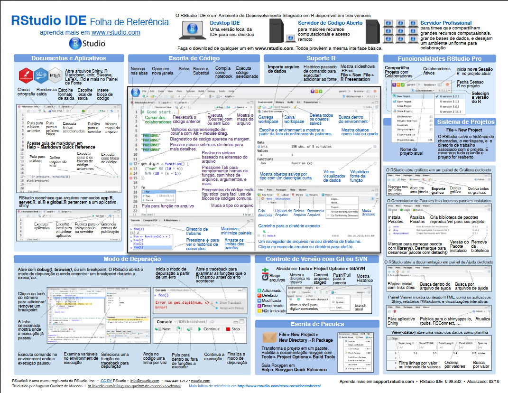

```{r, child="00-preamble.Rmd"}

```


# Tópicos desta aula

- [RStudio](#rstudio)


- [Introdução ao R](#introducao)


---
name: rstudio
class: middle, center

# `r blue("RStudio")`


---
## Painéis

Ao abrir o RStudio, você verá 4 quadrantes:

```{r echo=FALSE, fig.align='center', out.width=500, out.height=400}
knitr::include_graphics(rep("img/rstudio-editor.png"))
```

---
<br><br>

Esses quadrantes representam o **editor**, o **console**, o **environment** e o **output**. Eles vêm nesta ordem, mas você pode organizá-los da forma que preferir acessando a seção *Pane Layout* da opção `Global options...` no menu `Tools`.

O editor e o console são os dois principais painéis do RStudio. Passaremos a maior parte do tempo neles:

- **Editor/Scripts**: é onde escrevemos nossos códigos. Repare que o RStudio colore algumas palavras e símbolos para facilitar a leitura do código.

- **Console**: é onde rodamos o código e recebemos as saídas. `r blue("O R vive aqui!")`

---
<br><br>

Os demais painéis são auxiliares. O objetivo deles é facilitar pequenas tarefas que fazem parte tanto da programação quanto da análise de dados:

- **Environment**: painel com todos os objetos criados na sessão.

- **History**: painel com um histórico dos comandos rodados.

- **Files**: mostra os arquivos no diretório de trabalho. É possível navegar entre diretórios.

- **Plots**: painel onde os gráficos serão apresentados.

- **Packages**: apresenta todos os pacotes instalados e carregados.

- **Help**: janela onde a documentação das funções serão apresentadas.

- **Viewer**: painel onde relatórios e dashboards serão apresentados.

---
## Atalhos

Conhecer os atalhos do teclado ajuda bastante quando estamos programando no RStudio. Veja os principais:

- **CTRL+ENTER**: avalia/roda a linha selecionada no script. O atalho mais utilizado.

- **ALT+-**: cria no script um sinal de atribuição (<-). Você o usará o tempo todo.

- **CTRL+SHIFT+M**: (%>%) operador *pipe*. Guarde esse atalho, será bastante utilizado.

- **CTRL+1**: altera cursor para o script.

- **CTRL+2**: altera cursor para o console.

- **ALT+SHIFT+K**: janela com todos os atalhos disponíveis.

No MacOS, substitua **CTRL** por **command** e **ALT** por **option**.

---
## Projetos

Uma funcionalidade muito importante do RStudio é a possibilidade de criar **projetos**. 

Um projeto é uma pasta no seu computador. Nessa pasta, estarão todos os arquivos que você usurá ou criará na sua análise. 

A principal razão de utilizarmos projetos é **organização**. Com eles, fica muito mais fácil importar bases de dados para dentro do R, criar análises reprodutíveis e compartilhar o nosso trabalho.

<br>

`r blue("Habitue-se desde a cedo a criar um projeto para cada nova análise que for fazer.")`

---
<br><br>

Para criar um projeto, clique em `New Project...` no Menu `File`. Na caixa de diálogo que aparecerá, clique em `New Directory` para criar o projeto em uma nova pasta ou `Existing Directory` para criar em uma pasta existente. 

Se você tiver o `Git` instalado, você também pode usar projetos para conectar com repositórios do Github e outras plataformas de desenvolvimento. Para isso, basta clicar em `Version Control`.

Se você não sabe o que é Git, Github ou versionamento, veja [este material](https://beatrizmilz.github.io/slidesR/git_rstudio.html) da [Beatriz Milz](https://twitter.com/BeaMilz), ou [este post](https://www.curso-r.com/blog/2019-07-23-zen-do-r-4/) no nosso blog.

Criando um projeto, o RStudio criará na pasta escolhida um arquivo `nome-do-projeto.Rproj`. Você pode usar esse arquivo para iniciar o RStudio já com o respectivo projeto aberto.

---
## RStudio com um projeto aberto

```{r echo=FALSE, fig.align='center'}
knitr::include_graphics(rep("img/exemplo-projeto-aberto.png"))
```

---
## Navegando entre projetos

```{r echo=FALSE, fig.align='center'}
knitr::include_graphics(rep("img/exemplo-lista-projetos.png"))
```

---
## Cheatsheets

O RStudio tem à disposição algumas *folhas de cola*, as **cheatsheets**. Elas trazem um resumão de como utilizar diversos pacotes e até o próprio RStudio. 
Para acessá-las, basta clicar no menu `Help` e então em `Cheatsheets`, ou no [site da RStudio](https://rstudio.com/resources/cheatsheets/).

```{r echo=FALSE, fig.align='center', out.width=500}

```

---
class: middle, center
name: introducao

# `r blue("Introdução ao R")`


---
## R como calculadora

O papel do **Console** no R é executar os nossos comandos. Ele avalia o código que passamos para ele e devolve a saída correspondente (se tudo der certo) ou uma mensagem de erro (se o seu código tiver algum problema).

> Para rodar um código, escreva o código no script e, com o cursor em cima da linha que você quer rodar, use o atalho "CTRL+ENTER". Você não precisa selecionar o código, a não ser que queria rodar várias linhas de uma única vez.

Vamos começar com um exemplo de operação comum:

```{r}
1 + 1
```

Nesse caso, o nosso comando foi o código `1 + 1` e a saída foi o valor `2`.

---
<br><br>

Tente agora jogar no console a expressão: `2 * 2 - (4 + 4) / 2`. 

Repare que as operações e suas precedências são mantidas como na matemática, ou seja, divisão e multiplicação são calculadas antes da adição e subtração. E parênteses nunca são demais!

Pronto! Você já é capaz de pedir ao R para fazer qualquer uma das quatro operações aritméticas básicas.

<br>

> **Quando compilamos?** Quem vem de linguagens como o C ou Java espera que seja necessário compilar o código em texto para o código das máquinas (geralmente um código binário). No R, isso não é necessário. O R é uma linguagem de programação dinâmica que interpreta o seu código enquanto você o executa.

---
## Comandos incompletos

Se você digitar um comando incompleto, como `5 + `, e apertar `Enter`, o R mostrará um `+`, o que não tem nada a ver com a adição da matemática. Isso significa que o R está esperando que você enviar **mais** algum código para completar o seu comando. Termine o seu comando ou aperte `Esc` para recomeçar.

```
> 5 -
+ 
+ 5
[1] 0
```

---
## Erros

Se você digitar um comando que o R não reconhece, ele retornará uma mensagem de erro. 

<center>
<b>NÃO ENTRE EM PÂNICO!</b>
</center>

Ele só está avisando que não conseguiu interpretar o comando. Você pode digitar outro comando normalmente em seguida.

```
> 5 % 2
Error: unexpected input in "5 % 2"
> 5 ^ 2
[1] 25
```

---
## Objetos

O R te permite salvar valores dentro de um **objeto**. Um objeto é um nome que guarda um valor. Para criar um objeto, utilizamos o operador `<-`.

No exemplo abaixo, salvamos o valor `1` em `a`. Sempre que avaliarmos o objeto `a`, o R vai devolver o valor 1.

```{r}
# Salvando `1` em `a`
a <- 1

# Avaliando o objeto `a`
a
```

---
## Nomeando objetos

Existem algumas regras para dar nomes aos objetos. A mais importante é: o nome deve começar com uma letra. O nome pode conter números, mas não pode começar com números. Você pode usar pontos `.` e underlines `_` para separar palavras.

```{r, eval = FALSE}
# Permitido

x <- 1
x1 <- 2
objeto <- 3
meu_objeto <- 4
meu.objeto <- 5

# Não permitido

1x <- 1
_objeto <- 2
meu-objeto <- 3

```

---
<br><br>

O R **diferencia letras maiúsculas e minúsculas**, isto é, `b` é considerado um objeto diferente de `B`. Rode o exemplo abaixo e observe que dois objetos diferentes são criados no **Environment**.

```{r}
b <- 2
B <- 3

b
B
```

---
## Classes

A classe de um objeto é muito importante dentro do R. É a partir dela que as funções e operadores conseguem saber exatamente o que fazer com um objeto.

Por exemplo, podemos somar dois números, mas não conseguimos somar duas letras (texto):

```{r, error=TRUE}
1 + 1


"a" + "b"
```

O operador `+` verifica que `"a"` e `"b"` não são números (ou que a classe deles não é numérica) e devolve uma mensagem de erro informando isso.

---
## Texto

Observe que para criar texto no R, colocamos os caracteres entre aspas. As aspas servem para diferenciar *nomes* (objetos, funções, pacotes) de *textos* (letras e palavras). Os textos são muito comuns em variáveis categóricas.

```{r}
a <- 10

# O objeto `a`, sem aspas
a

# A letra (texto) `a`, com aspas
"a"
```

---
## A classe de um objeto

Para saber a classe de um objeto, basta rodarmos `class(nome-do-objeto)`.

```{r}
x <- 1
class(x)

y <- "a"
class(y)

class(mtcars)
```

---
## Objetos atômicos

As classes mais básicas dentro do R são:

- *numeric*
- *character*
- *logical*

Um objeto de qualquer uma dessas classes é chamado de **objeto atômico**. 

Esse nome se deve ao fato de essas classes não se misturarem, isto é, para um objeto ter a classe `numeric`, por exemplo, todos os seus valores precisam ser numéricos.

Mas como atribuir mais de um valor a um mesmo objeto? Para isso, precisamos criar **vetores**.

---
## Vetores

Vetores são estruturas muito importantes dentro R. Em especial, pensando em análise de dados, precisamos estudá-los pois cada coluna de um *data frame* será representada como um vetor.

Vetores são apenas **conjuntos indexados de valores**. Para criá-los, basta colocar os valores separados por vírgulas dentro de um `c()`.

```{r}
vetor1 <- c(1, 5, 3, -10)
vetor2 <- c("a", "b", "c")

vetor1
vetor2
```

---
## Sequências

Uma maneira fácil de criar um vetor com uma sequência de números é utilizar o operador `:`.

```{r}
# Vetor de 1 a 10
1:10

# Vetor de 10 a 1
10:1

# Vetor de -3 a 3
-3:3
```

---
## Subsetting

Quando dizemos que vetores são conjuntos *indexados*, isso quer dizer que cada valor dentro de um vetor tem uma **posição**. Essa posição é dada pela ordem em que os elementos foram colocados no momento em que o vetor foi criado. Isso nos permite acessar individualmente cada valor de um vetor. 

Para isso, colocamos o índice do valor que queremos acessar dentro de colchetes `[]`.

```{r}
vetor <- c("a", "b", "c", "d")

vetor[1]
vetor[4]
```
 
---
<br><br>

Você também pode colocar um conjunto de índices dentro dos colchetes, para pegar os valores contidos nessas posições:

```{r}
vetor[c(2, 3)]
vetor[c(1, 2, 4)]
```

Essas operações são conhecidas como *subsetting*, pois estamos pegando subconjuntos de valores de um vetor.

---
## Classe de um vetor

Um vetor só pode guardar um tipo de objeto e ele terá sempre a mesma classe dos objetos que guarda. Para saber a classe de um vetor, rodamos `class(nome-do-vetor)`.

```{r}
vetor1 <- c(1, 5, 3, -10)
vetor2 <- c("a", "b", "c")

class(vetor1)
class(vetor2)
```

---
## Coerção

Se tentarmos misturar duas classes, o R vai apresentar o comportamento conhecido como **coerção**.

```{r}
vetor <- c(1, 2, "a")

vetor
class(vetor)
```

Veja que todos os elementos do vetor se transformaram em texto. 

Como um vetor só pode ter uma classe de objeto dentro dele, classes mais fracas serão sempre reprimidas pelas classes mais fortes. Como regra de bolso: caracteres serão sempre a classe mais forte. Então, sempre que você misturar números e texto em um vetor, os números virarão texto.

---
## Operações com vetores

De forma bastante intuitiva, você pode fazer operações com vetores.

```{r}
vetor <- c(0, 5, 20, -3)
vetor + 1
```

Ao rodarmos `vetor1 + 1`, o R subtrai `1` de cada um dos elementos do vetor. O mesmo acontece com qualquer outra operação aritmética.

---
## Vetorização

Você também pode fazer operações que envolvem mais de um vetor:

```{r}
vetor1 <- c(1, 2, 3)
vetor2 <- c(10, 20, 30)

vetor1  + vetor2
```

Neste caso, o R irá alinhar os dois vetores e somar elemento a elemento. Esse tipo de comportamento é chamado de **vetorização**.

---
## Recliclagem

Isso pode ficar um pouco confuso quando os dois vetores não possuem o mesmo tamanho.

```{r}
vetor1 <- c(1, 2)
vetor2 <- c(10, 20, 30, 40)

vetor1 + vetor2
```

Embora estejamos somando dois vetores de tamanho diferentes, o R não devolve um erro (o que parecia ser a resposta mais intuitiva). O R alinhou os dois vetores e, como eles não possuíam o mesmo tamanho, o primeiro foi repetido para ficar do mesmo tamanho do segundo. É como se o primeiro vetor fosse na verdade `c(1, 2, 1, 2)`. 

Esse comportamento é chamado de **reciclagem**. 

---
<br><br>

Embora contra-intuitiva, a reciclagem é muito útil no R graças a um caso particular muito importante. 

Quando somamos `vetor + 1` no nosso primeiro exemplo, o que o R está fazendo por trás é transformando o `1` em `c(1, 1, 1, 1)` e realizando a soma vetorizada `c(0, 5, 20, -3) + c(1, 1, 1, 1)`. Isso porque o número `1` é um vetor de tamanho 1, isto é, `1` é igual a `c(1)`.

Usaremos esse comportamento no R o tempo todo. É muito importante a reciclagem para termos certeza de que o R está fazendo exatamente aquilo que gostaríamos que ele fizesse.

---
<br><br>

Um outro caso interessante de reciclagem é quando o comprimento dos vetores não são múltiplos um do outro. 

.tiny[
```{r}
vetor1 <- c(1, 2, 3)
vetor2 <- c(10, 20, 30, 40, 50)

vetor1 + vetor2
```
]

Neste caso, duas coisas aconteceram:

1. O R realizou a conta, repetindo cada valor do primeiro vetor até que os dois tenham o mesmo tamanho. No fundo, a operação realizada foi `c(1, 2, 3, 1, 2) + c(10, 20, 30, 40, 50)`.

2. Como essa operação é ainda menos intuitiva e raramente desejada, o R devolveu um aviso dizendo que o comprimento do primeiro vetor maior não é um múltiplo do comprimento do vetor menor.

---
## Pertence

Um outro operador muito útil é o `%in%`. Com ele, podemos verificar se um valor está dentro de um conjunto de valores (vetor).

```{r}
3 %in% c(1, 2, 3)
"a" %in% c("b", "c")
```

