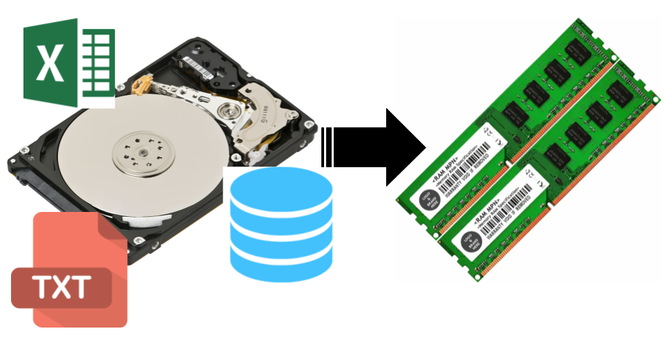

```{r, child="00-preamble.Rmd"}

```

# Tópicos desta aula

- [Pacotes](#pacotes)

- [Importação de bases de dados](#importacao)

- [Tabelas: Data.frames](#tabelas)

- [Operadores](#operadores)

- [Mais sobre Data.frames](#tabelas2)

---
class: middle, center
name: pacotes

# `r blue("Pacotes")`

---
## Pacotes

Um pacote no R é um conjunto de funções que visam resolver um problema em específico. O R já vem com alguns pacotes instalados. Geralmente chamamos esses pacotes de *base R*.

Mas a força do R está na gigantesca variedade de pacotes desenvolvidos pela comunidade, em especial, pelos criadores do `tidyverse`.

---
## Instalando e carregando pacotes

Para instalar um pacote, usamos a função `install.packages`.

```{r, eval=FALSE}
# Instalando um pacote
install.packages("tidyverse")

# Instalando vários pacotes de uma vez
install.packages(c("tidyverse", "rmarkdown", "devtools"))
```

Para usar as funções de um pacote, precisamos carregá-lo. Fazemos isso usando a função `library()`.

```{r, eval=FALSE}
library(tidyverse)
```

---
class:: center
<br><br>

`r blue('Instale uma vez, carregue várias vezes!')`

```{r, echo=FALSE}

```


---
class: middle, center
name: importacao

# `r blue("Importação de bases de dados")`

---

## Importação de bases de dados
### O que é?

Importar uma base de dados para o R significa levar a informação contida no disco rígido (HD) para a mé moria RAM.

```{r, echo=FALSE}


library(readr)
```


---
## Lendo tabelas

Para ler tabelas, como arquivos `.csv`, utilizaremos funções do pacote `readr`.

Para isso, utilizamos a função `read_csv()` ou `read_csv2()`. Se o arquivo estiver bem formatado, a função só precisa do caminho até o arquivo para funcionar.


---
<br><br>

A mensagem devolvida pela função indica qual classe foi atribuída para cada coluna da base.

.tiny[
```{r, echo=FALSE}
voos_csv <- readr::read_csv2("../dados/voos_de_janeiro.csv")
```
]


---
<br><br>

- Em alguns países, como o Brasil, as vírgulas são utilizadas para separar as casas decimais dos números, inviabilizando os arquivos `.csv`.  Nesses casos, os arquivos `.csv` são na verdade separados por ponto-e-vírgula. Para ler bases separadas por ponto-e-vírgula no R, utilize a função `read_csv2()`.

```{r, eval=FALSE}
voos_csv <- readr::read_csv2("../dados/voos_de_janeiro.csv")
```

- Arquivos `.txt` podem ser lidos com a função `read_delim()`. Além do caminho até o arquivo, você também precisa indicar qual é o caractere utilizado para separar as colunas da base.  Um arquivo separado por tabulação, por exemplo, pode ser lido utilizando a o código abaixo. O código `\t` é uma forma textual de representar a tecla TAB.


- Para ler planilhas do Excel (arquivos `.xlsx` ou `.xls`), basta utilizarmos a função `read_excel()` do pacote `readxl`. 


---
class: middle, center
name: tabelas

# `r blue("Tabelas no R: Data frames")`


---
## Tabelas no r: Data frames

O objeto mais importante para o cientista de dados é, claro, a base de dados. No R, uma base de dados é representa por objetos chamados de *data frames*. Eles são equivalentes a uma tabela do SQL ou uma planilha do Excel.

A principal característica de um *data frame* é possuir linhas e colunas:

```{r, eval=FALSE}
mtcars
```

.tiny[
```{r, echo=FALSE}
head(mtcars, 10)
```
]

---
<br><br>

O `mtcars` é um *data frame* nativo do R que contém informações sobre diversos modelos de carros. Ele possui 32 linhas e 11 colunas (só estamos vendo as primeiras 10 linhas no slide anterior). 

A primeira "coluna" representa apenas o *nome* das linhas (modelo do carro), não é uma coluna da base. Repare que ela não possui um nome, como as outras. Essa estrutura de nome de linha é própria de *data frames* no R. Se exportássemos essa base para o Excel, por exemplo, essa coluna não apareceria.

Se você quiser saber mais sobre o `mtcars`, veja a documentação dele rodando `?mtcars` no **Console**.

Para entender melhor sobre *data frames*, precisamos estudar um pouco sobre classes, vetores e testes lógicos.

---
## Classes

A classe de um objeto é muito importante dentro do R. É a partir dela que as funções e operadores conseguem saber exatamente o que fazer com um objeto.

Por exemplo, podemos somar dois números, mas não conseguimos somar duas letras (texto):

```{r, error=TRUE}
1 + 1
"a" + "b"
```

O operador `+` verifica que `"a"` e `"b"` não são números (ou que a classe deles não é numérica) e devolve uma mensagem de erro informando isso.

---
## Texto

Observe que para criar texto no R, colocamos os caracteres entre aspas. As aspas servem para diferenciar *nomes* (objetos, funções, pacotes) de *textos* (letras e palavras). Os textos são muito comuns em variáveis categóricas.

```{r}
a <- 10
# O objeto `a`, sem aspas
a
# A letra (texto) `a`, com aspas
"a"
```

---
## A classe de um objeto

Para saber a classe de um objeto, basta rodarmos `class(nome-do-objeto)`.

```{r}
x <- 1
class(x)
y <- "a"
class(y)
class(mtcars)
```


---
class: middle, center
name: operadores

# `r blue("Operadores")`


---
## Operações lógicas

Uma operação lógica é um teste que retorna **verdadeiro** ou **falso**. No R (e em outras linguagens de programação), esses valores dois valores recebem uma classe especial: `logical`.

O verdadeiro no R vai ser representado pelo valor `TRUE` e o falso pelo valor `FALSE`. Esses nomes no R são **reservados**, isto é, você não pode chamar nenhum objeto de TRUE ou FALSE.

.tiny[
```{r, eval = FALSE}
TRUE <- 1
## Error in TRUE <- 1 : invalid (do_set) left-hand side to assignment
```
]

---
## Valores lógicos

Checando a classe desses valores, vemos que são lógicos (também conhecidos como valores binários ou booleanos). Eles são os únicos possíveis valores dessa classe.

```{r}
class(TRUE)
class(FALSE)
```

Agora que conhecemos o `TRUE` e `FALSE`, podemos explorar os teste lógicos.

---
## Igualdades
 
Começando pela igualdade: vamos testar se um valor é igual ao outro. Para isso, usamos o operador `==`.

.tiny[
```{r}
# Testes com resultado verdadeiro
1 == 1
"a" == "a"
# Testes com resultado falso
1 == 2
"a" == "b"
```
]

---
## Diferenças

Também podemos testar se dois valores são diferentes. Para isso, usamos o operador `!=`.

.tiny[
```{r}
# Testes com resultado falso
1 != 1
"a" != "a"
# Testes com resultado verdadeiro
1 != 2
"a" != "b"
```
]

---
## Desigualdades

Para comparar se um valor é maior que outro, temos à disposição 4 operadores:

.tiny[
```{r}
# Maior
3 > 3
3 > 2
# Maior ou igual
3 > 4
3 >= 3
```
]

---
<br><br>

```{r}
# Menor 
3 < 3
3 < 4
# Menor ou igual
3 < 2
3 <= 3
```

---
## Pertence

Um outro operador muito útil é o `%in%`. Com ele, podemos verificar se um valor está dentro de um conjunto de valores (vetor).

```{r}
3 %in% c(1, 2, 3)
"a" %in% c("b", "c")
```

---
## Filtros

Os testes lógicos fazem parte de uma operação muito comum na manipulação de base de dados: os **filtros**. No Excel, por exemplo, quando você filtra uma planilha, o que está sendo feito por trás é um teste lógico.

Falamos anteriormente que cada coluna das nossas bases de dados será representada dentro do R como um vetor. O comportamento que explica a importância dos testes lógicos na hora de filtrar uma base está ilustrado abaixo:

```{r}
minha_coluna <- c(1, 3, 0, 10, -1, 5, 20)
minha_coluna > 3
minha_coluna[minha_coluna > 3]
```

---
<br><br>

Muitas coisas aconteceram no código anterior, vamos por partes.

Primeiro, na operação `minha_coluna > 3` o R fez um excelente uso do comportamento de reciclagem. No fundo, o que ele fez foi transformar (reciclar) o valor `3` no vetor `c(3, 3, 3, 3, 3, 3, 3)` e  testar se `c(1, 3, 0, 10, -1, 5, 20) > c(3, 3, 3, 3, 3, 3, 3)`. 

Como os operadores lógicos também são vetorizados (fazem operações elemento a elemento), os testes realizados foram `1 > 3`, `3 > 3`, `0 > 3`, `10 > 3`, `-1 > 3`, `5 > 3` e, finalmente, `20 > 3`. Cada um desses testes tem o seu próprio resultado. Por isso a saída de `minha_coluna > 3` é um vetor de verdadeiros e falsos, respectivos a cada um desses 7 testes.

A segunda operação traz a grande novidade aqui: podemos usar os valores `TRUE` e `FALSE` para selecionar elementos de um vetor!

A regra é a seguinte: **retornar** as posições que receberem `TRUE`, **não retornar** as posições que receberem `FALSE`. 

---
<br><br>

Portanto, a segunda operação é equivalente a:

```{r}
minha_coluna[c(FALSE, FALSE, FALSE, TRUE, FALSE, TRUE, TRUE)]
```

O vetor lógico filtra o vetor `minha_coluna`, retornando apenas os valores maiores que 3, já que foi esse o teste lógico que fizemos. 

Essa é a *mágica* que acontece por trás de filtros no R. Na prática, não precisaremos usar colchetes, não lembraremos da reciclagem e nem veremos a cara dos `TRUE` e `FALSE`. Mas conhecer esse processo é muito importante, principalmente para encontrar problemas de código ou de base.

---
name: tabelas2
# Mais sobre data frames

Chegou a hora de usarmos tudo o que aprendemos na seção anterior para exploramos ao máximo o nosso objeto favorito: o *data frame*. 

Para isso, continuaremos a usar o `mtcars`.

```{r, eval=FALSE}
mtcars
```

.tiny[
```{r, echo=FALSE}
head(mtcars, 10)
```
]

---
## Acessando as colunas

Lembrando que cada coluna de um *data frame* é um vetor, podemos usar o operador `$` para acessar cada uma de suas colunas.

.tiny[
```{r}
mtcars$mpg
mtcars$cyl
mtcars$wt
```
]

---
## Dimensões

A classe *data frame* possui uma característica especial: seus objetos possuem duas **dimensões**.

```{r}
class(mtcars)
dim(mtcars)
```

O resultado do código `dim(mtcars)` nos diz que a primeira dimensão tem comprimento 32 e a segunda dimensão tem comprimento 11. Em outras palavras: a base `mtcars` tem 32 linhas e 11 colunas.

---
## Subsetting

Ter duas dimensões significa que devemos usar dois índices para acessar os valores de um *data frame* (fazer *subsetting*). Para isso, ainda usamos o colchete, mas agora com dois argumentos: `[linha, coluna]`.

```{r}
mtcars[2, 3]
```

O código acima está nos devolvendo o valor presente na segunda linha da terceira coluna da base `mtcars`.

---
<br><br>

Também podemos pegar todos as linhas de uma coluna ou todas as colunas de uma linha deixando um dos argumentos vazio:

.tiny[
```{r}
# Todas as linhas da coluna 1
mtcars[,1]
# Todas as colunas da linha 1
mtcars[1,]
```
]

---
## Selecionando colunas

Podemos usar o *subsetting* para selecionar colunas:

```{r, eval = FALSE}
mtcars[, c(1, 2)]
```

.tidy[
```{r, echo = FALSE}
head(mtcars[, c(1, 2)], 10)
```
]

---
<br><br>

```{r, eval = FALSE}
mtcars[, c("mpg", "am")]
```

.tidy[
```{r, echo = FALSE}
head(mtcars[, c("mpg", "am")], 10)
```
]

Nos dois exemplos, exibimos apenas as 5 primeiras linhas do *data frame*.
---
## Filtrando linhas

Também podemos usar o *subsetting* para filtrar linhas:

.tiny[
```{r}
mtcars$cyl == 4
mtcars[mtcars$cyl == 4, ]
```
]

---
<br><br>

O código `mtcars$cyl == 4` nos diz em quais linhas estão os carros com 4 cilindros. Quando usamos o vetor de `TRUE` e `FALSE` resultante dentro do *subsetting* das linhas em `mtcars[mtcars$cyl == 4, ]`, o R nos devolve todos as colunas dos carros com 4 cilindros.  A regra é a seguinte: linha com `TRUE` é retornada, linha com `FALSE` não.

Outro exemplo:

.tiny[
```{r}
mtcars[mtcars$mpg > 25, ]
```
]
